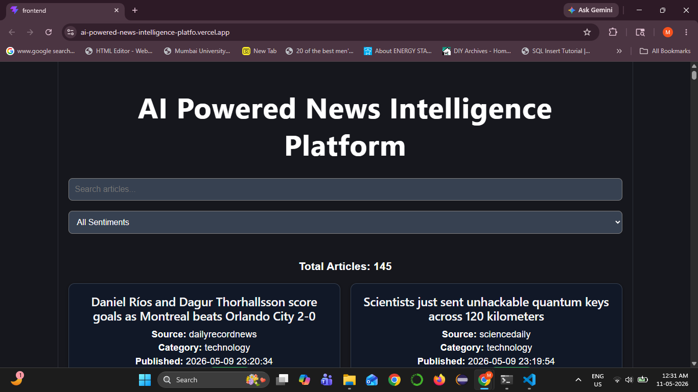
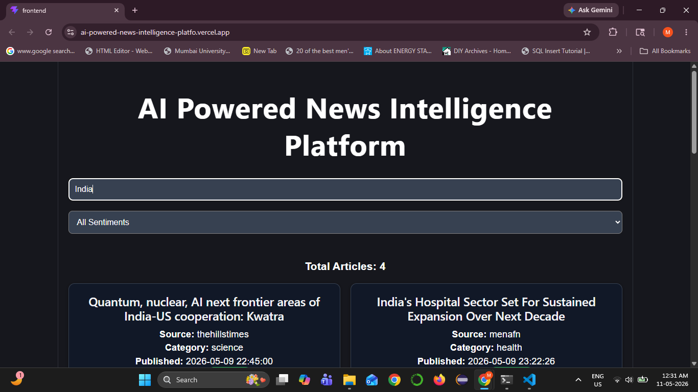
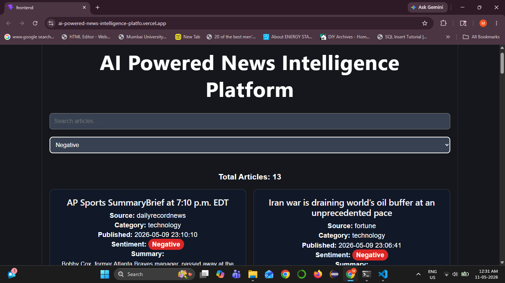
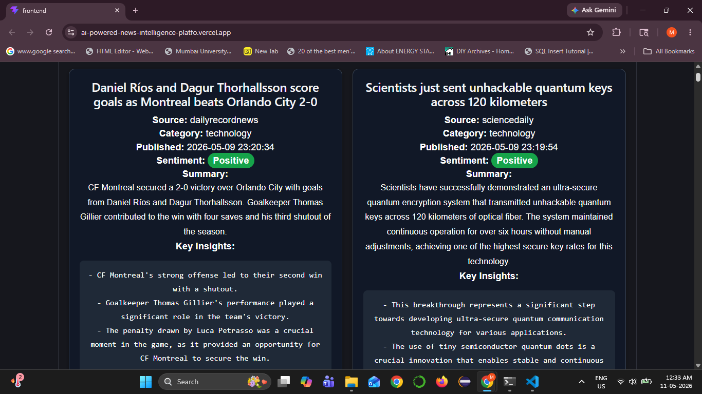
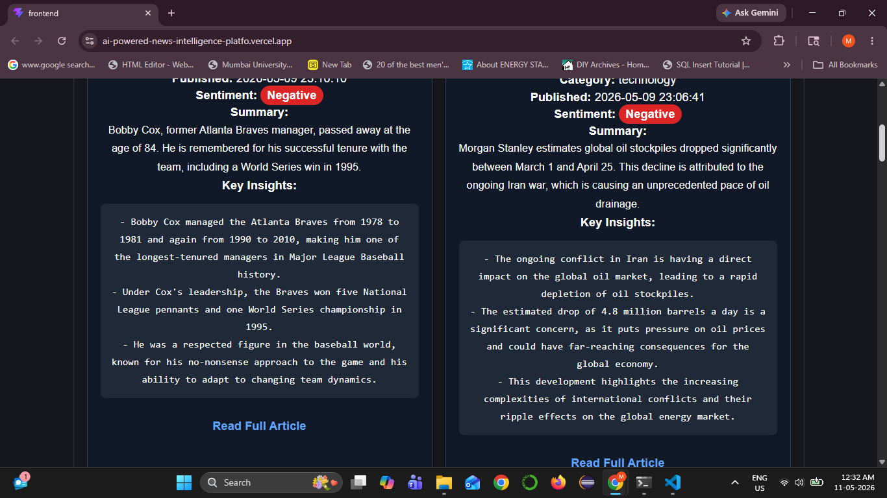
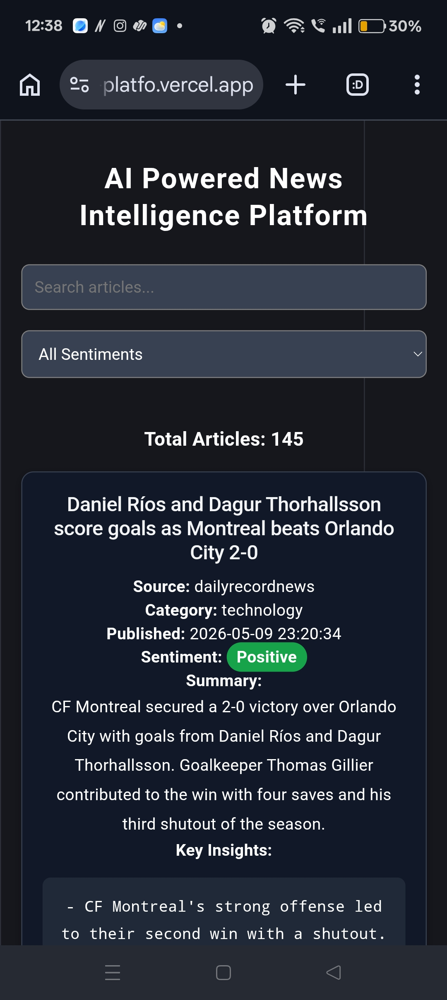

# Ai Powered News Intelligence Platform

## Introduction

An end to end Ai powered news analytics dashboard that fetches news articles, process them by Ai, detect sentiments type, and present actional insights through interactive website

----

## Live Demo

Frontend :

https://ai-powered-news-intelligence-platfo.vercel.app/


Backend API :

https://ai-news-backend-w4ex.onrender.com/articles


## Features


- Fetches real-time news articles from NewsData.io API
- Process 100-500 articles with pagination
- Cleans and deduplicates incoming data
- Ai generated summaries for each and every article
- Analyze and show sentiments of articles
- Ai generated key insights extracted
- Search functionality 
- Sentiment filtering
- Full stack deployment with Vercel and Render

---

## Tech Stack

### Frontend
- React.js
- Axios
- Vite

### Backend
- FastAPI
- SQLAlchemy
- Python

### Database
- SQLite

### AI Integration
- Groq LLM API

### Deployment
- Vercel (Frontend)
- Render (Backend)

---

## Project Architecture

- NewsData.io API
- Python Data Pipeline
- Data Cleaning & Deduplication
- AI Processing (Summary + Sentiment + Insights)
- SQLite Database
- FastAPI Backend
- React Dashboard Frontend

---

## AI Features

### 1. Article Summarization
Generates concise 1–2 sentence summaries for each article.

### 2. Sentiment Analysis
Classifies news sentiment into:
- Positive
- Neutral
- Negative

### 3. Key Insight Extraction
Extracts 3–5 actionable insights from each article using AI.

---

## Dashboard Features

- Responsive mobile-friendly UI
- Article search functionality
- Sentiment-based filtering
- Category display
- Total article counter
- Professional card-based layout

---

## Setup Instructions

### 1. Clone Repository

```bash
git clone https://github.com/MadanKumarMani/ai-powered-news-intelligence-platform.git
```

---

### 2. Backend Setup

```bash
cd backend
pip install -r requirements.txt
```

Create `.env` file:

```env
NEWSDATA_API_KEY=your_api_key
GROQ_API_KEY=your_api_key
```

Run backend:

```bash
uvicorn main:app --reload
```

---

### 3. Frontend Setup

```bash
cd frontend
npm install
npm run dev
```

---

## API Endpoints

### Get Articles

```http
GET /articles
```

Returns processed news articles with:
- summaries
- sentiment
- insights
- metadata

---

## Screenshots


### Dashboard Overview




### Search Functionality




### Sentiment Filtering




### Summary




### Key Insights




### Mobile Responsive View




---

## Future Improvements

- User authentication
- Advanced analytics dashboard
- Trending topics visualization
- Category-wise charts
- Bookmarking system
- Real-time article refresh
- PostgreSQL migration

---

## Author

Madan Kumar


